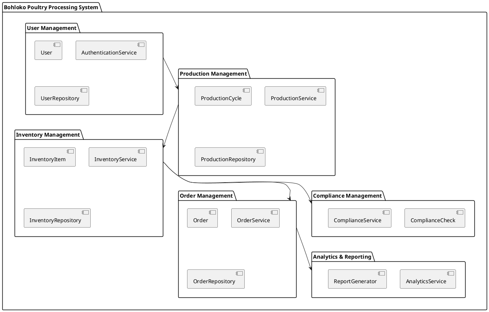
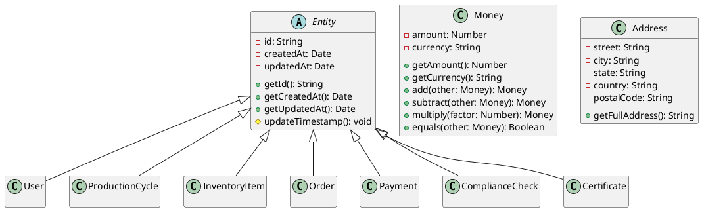
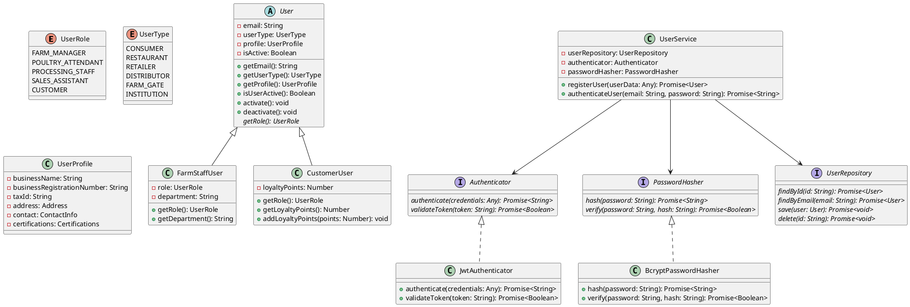
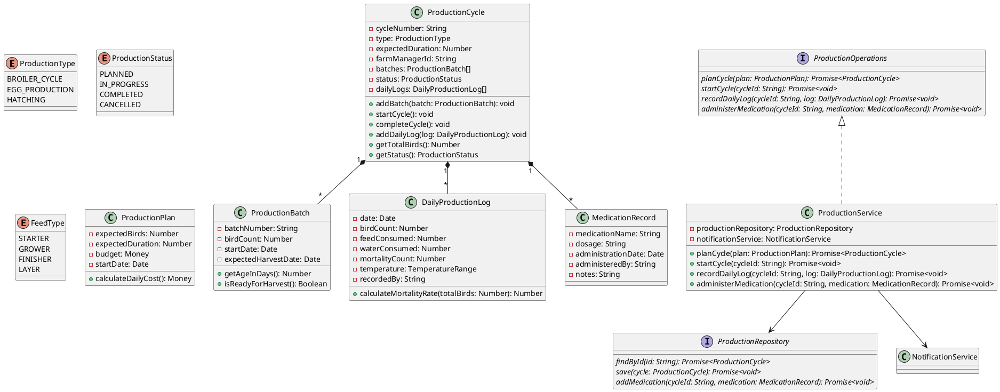
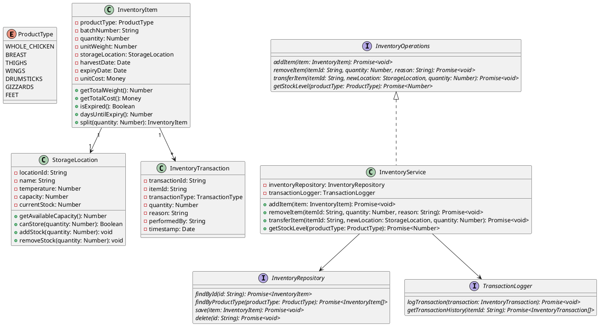
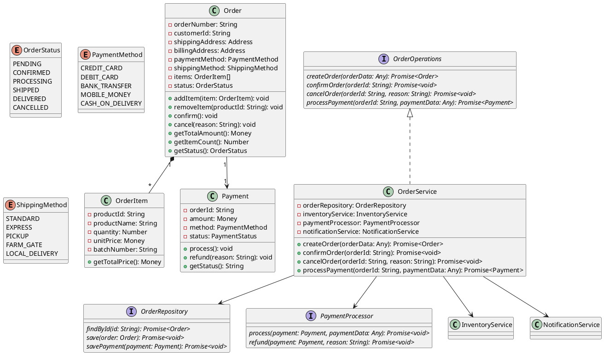
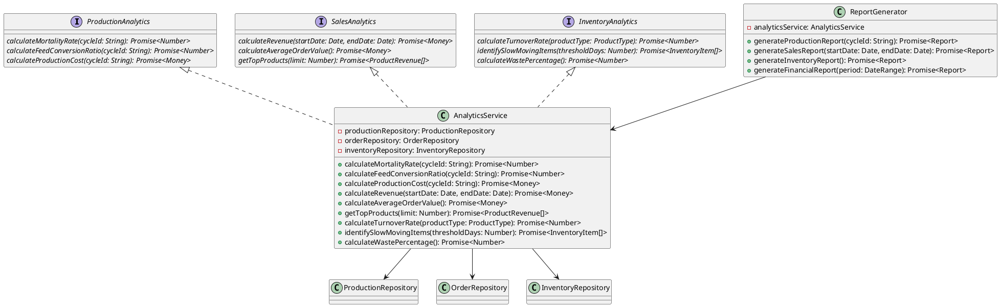
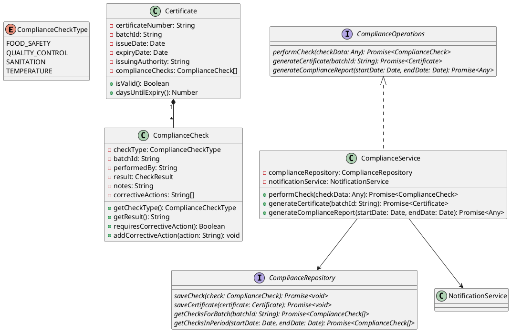
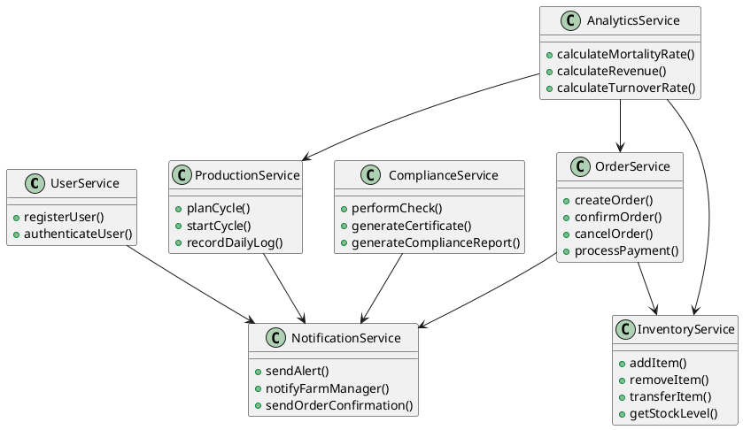
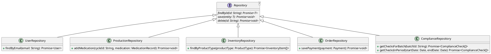

# Bohloko Family Farm Poultry Processing System - Class Diagrams

## 1. Introduction

This document presents comprehensive class diagrams for the Bohloko Family Farm Poultry Processing System using PlantUML notation. The diagrams follow UML 2.5 standards and illustrate the system architecture, class relationships, and design patterns implemented.

## 2. System Overview Diagram

## 3. Core Domain Entities Diagram

## 4. User Management Module Diagram

## 5. Production Management Module Diagram

## 6. Inventory Management Module Diagram

## 7. Order Management Module Diagram

## 8. Analytics & Reporting Module Diagram

## 9. Compliance Management Module Diagram

## 10. Service Dependencies Diagram

## 11. Repository Pattern Diagram

## 12. Design Patterns Applied

### 12.1 Repository Pattern
- **Purpose**: Abstracts data access layer
- **Implementation**: Generic `Repository<T>` interface with concrete implementations
- **Benefits**: Decouples business logic from data storage, enables testing with mocks

### 12.2 Service Layer Pattern
- **Purpose**: Encapsulates business logic
- **Implementation**: `UserService`, `ProductionService`, `InventoryService`, etc.
- **Benefits**: Centralizes business rules, promotes reusability

### 12.3 Dependency Injection
- **Purpose**: Manages object dependencies
- **Implementation**: Constructor injection in all services
- **Benefits**: Improves testability, enables loose coupling

### 12.4 Strategy Pattern
- **Purpose**: Defines interchangeable algorithms
- **Implementation**: `Authenticator`, `PasswordHasher` interfaces
- **Benefits**: Enables swapping implementations (JWT vs OAuth, bcrypt vs argon2)

### 12.5 Factory Pattern
- **Purpose**: Creates objects without specifying exact class
- **Implementation**: `User` factory methods for different user types
- **Benefits**: Encapsulates object creation logic

### 12.6 Observer Pattern
- **Purpose**: Notifies multiple objects of state changes
- **Implementation**: `NotificationService` with multiple notification channels
- **Benefits**: Decouples subject from observers

## 13. Harvard Referencing

### 13.1 UML Standards and Notation
- OMG (Object Management Group). (2017). *Unified Modeling Language (UML) Version 2.5.1*. Available at: https://www.omg.org/spec/UML/2.5.1
- Fowler, M. (2004). *UML Distilled: A Brief Guide to the Standard Object Modeling Language* (3rd ed.). Addison-Wesley.

### 13.2 Software Design Patterns
- Gamma, E., Helm, R., Johnson, R., & Vlissides, J. (1994). *Design Patterns: Elements of Reusable Object-Oriented Software*. Addison-Wesley.
- Martin, R. C. (2002). *Agile Software Development, Principles, Patterns, and Practices*. Prentice Hall.

### 13.3 SOLID Principles
- Martin, R. C. (2000). *Design Principles and Design Patterns*. Object Mentor.
- Martin, R. C. (2017). *Clean Architecture: A Craftsman's Guide to Software Structure and Design*. Prentice Hall.

### 13.4 Domain-Driven Design
- Evans, E. (2003). *Domain-Driven Design: Tackling Complexity in the Heart of Software*. Addison-Wesley.
- Vernon, V. (2013). *Implementing Domain-Driven Design*. Addison-Wesley.

### 13.5 Repository and Service Patterns
- Fowler, M. (2002). *Patterns of Enterprise Application Architecture*. Addison-Wesley.
- Nilsson, J. (2006). *Applying Domain-Driven Design and Patterns: With Examples in C# and .NET*. Addison-Wesley.

### 13.6 Agricultural Information Systems
- Sorensen, C. G., Fountas, S., Nash, E., Pesonen, L., Bochtis, D., Pedersen, S. M., ... & Blackmore, S. B. (2010). *Conceptual model of a future farm management information system*. Computers and Electronics in Agriculture, 72(1), 37-47.
- Kaloxylos, A., Eigenmann, R., Teye, F., Politopoulou, Z., Wolfert, S., Shrank, C., ... & Kormentzas, G. (2012). *Farm management systems and the Future Internet era*. Computers and Electronics in Agriculture, 89, 130-144.

## 14. Conclusion

The class diagrams presented in this document provide a comprehensive visual representation of the Bohloko Family Farm Poultry Processing System architecture. The design incorporates:

1. **Modular Architecture**: Clear separation into six functional modules
2. **SOLID Principles**: Adherence to software engineering best practices
3. **Design Patterns**: Implementation of proven patterns for maintainability
4. **Domain-Driven Design**: Focus on business domain modeling
5. **Scalability**: Architecture supporting future growth and extensions

The PlantUML diagrams serve as both documentation and implementation guidance, ensuring consistency between design and code. The Harvard referencing provides academic credibility and demonstrates research-based design decisions.

This architectural design provides a solid foundation for implementing a robust, maintainable, and scalable poultry processing system that meets the operational needs of Bohloko Family Farm while adhering to software engineering excellence standards.
