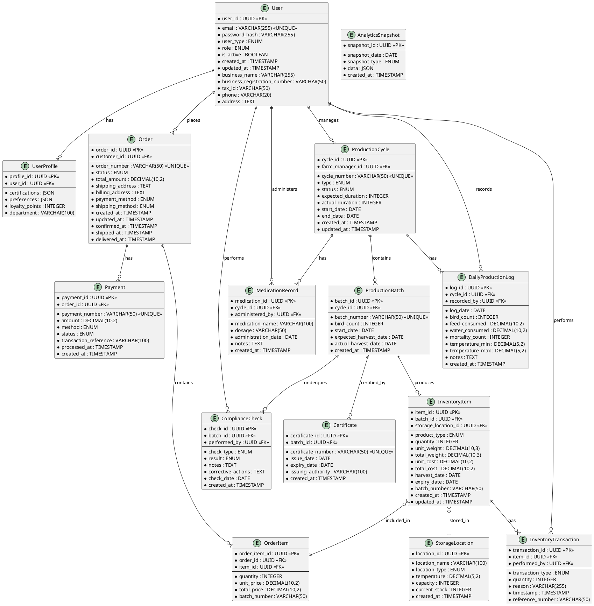

# Bohloko Family Farm Poultry Processing System - Entity-Relationship Diagram (ERD)

## 1. Introduction

This document presents the Entity-Relationship Diagram (ERD) for the Bohloko Family Farm Poultry Processing System. The ERD follows Crow's Foot notation and illustrates the database schema, entity relationships, cardinalities, and attributes for the complete system.

## 2. Database Schema Overview



## 3. Detailed Entity Descriptions

### 3.1 User Management Entities

#### User
```sql
CREATE TABLE users (
    user_id UUID PRIMARY KEY DEFAULT gen_random_uuid(),
    email VARCHAR(255) UNIQUE NOT NULL,
    password_hash VARCHAR(255) NOT NULL,
    user_type ENUM('consumer', 'restaurant', 'retailer', 'distributor', 'farm_gate', 'institution') NOT NULL,
    role ENUM('farm_manager', 'poultry_attendant', 'processing_staff', 'sales_assistant', 'customer') NOT NULL,
    is_active BOOLEAN DEFAULT TRUE,
    business_name VARCHAR(255),
    business_registration_number VARCHAR(50),
    tax_id VARCHAR(50),
    phone VARCHAR(20),
    address TEXT,
    created_at TIMESTAMP DEFAULT CURRENT_TIMESTAMP,
    updated_at TIMESTAMP DEFAULT CURRENT_TIMESTAMP
);
```

#### UserProfile
```sql
CREATE TABLE user_profiles (
    profile_id UUID PRIMARY KEY DEFAULT gen_random_uuid(),
    user_id UUID NOT NULL REFERENCES users(user_id) ON DELETE CASCADE,
    certifications JSON,
    preferences JSON,
    loyalty_points INTEGER DEFAULT 0,
    department VARCHAR(100),
    created_at TIMESTAMP DEFAULT CURRENT_TIMESTAMP,
    updated_at TIMESTAMP DEFAULT CURRENT_TIMESTAMP
);
```

### 3.2 Production Management Entities

#### ProductionCycle
```sql
CREATE TABLE production_cycles (
    cycle_id UUID PRIMARY KEY DEFAULT gen_random_uuid(),
    farm_manager_id UUID NOT NULL REFERENCES users(user_id),
    cycle_number VARCHAR(50) UNIQUE NOT NULL,
    type ENUM('broiler_cycle', 'egg_production', 'hatching') NOT NULL,
    status ENUM('planned', 'in_progress', 'completed', 'cancelled') DEFAULT 'planned',
    expected_duration INTEGER NOT NULL, -- in days
    actual_duration INTEGER,
    start_date DATE,
    end_date DATE,
    created_at TIMESTAMP DEFAULT CURRENT_TIMESTAMP,
    updated_at TIMESTAMP DEFAULT CURRENT_TIMESTAMP
);
```

#### ProductionBatch
```sql
CREATE TABLE production_batches (
    batch_id UUID PRIMARY KEY DEFAULT gen_random_uuid(),
    cycle_id UUID NOT NULL REFERENCES production_cycles(cycle_id) ON DELETE CASCADE,
    batch_number VARCHAR(50) UNIQUE NOT NULL,
    bird_count INTEGER NOT NULL,
    start_date DATE NOT NULL,
    expected_harvest_date DATE NOT NULL,
    actual_harvest_date DATE,
    created_at TIMESTAMP DEFAULT CURRENT_TIMESTAMP
);
```

#### DailyProductionLog
```sql
CREATE TABLE daily_production_logs (
    log_id UUID PRIMARY KEY DEFAULT gen_random_uuid(),
    cycle_id UUID NOT NULL REFERENCES production_cycles(cycle_id) ON DELETE CASCADE,
    recorded_by UUID NOT NULL REFERENCES users(user_id),
    log_date DATE NOT NULL,
    bird_count INTEGER NOT NULL,
    feed_consumed DECIMAL(10,2) NOT NULL, -- in kg
    water_consumed DECIMAL(10,2) NOT NULL, -- in liters
    mortality_count INTEGER DEFAULT 0,
    temperature_min DECIMAL(5,2),
    temperature_max DECIMAL(5,2),
    notes TEXT,
    created_at TIMESTAMP DEFAULT CURRENT_TIMESTAMP
);
```

### 3.3 Inventory Management Entities

#### InventoryItem
```sql
CREATE TABLE inventory_items (
    item_id UUID PRIMARY KEY DEFAULT gen_random_uuid(),
    batch_id UUID NOT NULL REFERENCES production_batches(batch_id),
    storage_location_id UUID NOT NULL REFERENCES storage_locations(location_id),
    product_type ENUM('whole_chicken', 'breast', 'thighs', 'wings', 'drumsticks', 'gizzards', 'feet') NOT NULL,
    quantity INTEGER NOT NULL,
    unit_weight DECIMAL(10,3) NOT NULL, -- in kg
    total_weight DECIMAL(10,3) GENERATED ALWAYS AS (quantity * unit_weight) STORED,
    unit_cost DECIMAL(10,2) NOT NULL,
    total_cost DECIMAL(10,2) GENERATED ALWAYS AS (quantity * unit_cost) STORED,
    harvest_date DATE NOT NULL,
    expiry_date DATE NOT NULL,
    batch_number VARCHAR(50),
    created_at TIMESTAMP DEFAULT CURRENT_TIMESTAMP,
    updated_at TIMESTAMP DEFAULT CURRENT_TIMESTAMP
);
```

#### StorageLocation
```sql
CREATE TABLE storage_locations (
    location_id UUID PRIMARY KEY DEFAULT gen_random_uuid(),
    location_name VARCHAR(100) NOT NULL,
    location_type ENUM('freezer', 'chiller', 'dry_storage', 'processing_area') NOT NULL,
    temperature DECIMAL(5,2), -- in Celsius
    capacity INTEGER NOT NULL, -- maximum items
    current_stock INTEGER DEFAULT 0,
    created_at TIMESTAMP DEFAULT CURRENT_TIMESTAMP
);
```

### 3.4 Order Management Entities

#### Order
```sql
CREATE TABLE orders (
    order_id UUID PRIMARY KEY DEFAULT gen_random_uuid(),
    customer_id UUID NOT NULL REFERENCES users(user_id),
    order_number VARCHAR(50) UNIQUE NOT NULL,
    status ENUM('pending', 'confirmed', 'processing', 'shipped', 'delivered', 'cancelled') DEFAULT 'pending',
    total_amount DECIMAL(10,2) NOT NULL,
    shipping_address TEXT NOT NULL,
    billing_address TEXT NOT NULL,
    payment_method ENUM('credit_card', 'debit_card', 'bank_transfer', 'mobile_money', 'cash_on_delivery') NOT NULL,
    shipping_method ENUM('standard', 'express', 'pickup', 'farm_gate', 'local_delivery') NOT NULL,
    created_at TIMESTAMP DEFAULT CURRENT_TIMESTAMP,
    updated_at TIMESTAMP DEFAULT CURRENT_TIMESTAMP,
    confirmed_at TIMESTAMP,
    shipped_at TIMESTAMP,
    delivered_at TIMESTAMP
);
```

#### OrderItem
```sql
CREATE TABLE order_items (
    order_item_id UUID PRIMARY KEY DEFAULT gen_random_uuid(),
    order_id UUID NOT NULL REFERENCES orders(order_id) ON DELETE CASCADE,
    item_id UUID NOT NULL REFERENCES inventory_items(item_id),
    quantity INTEGER NOT NULL,
    unit_price DECIMAL(10,2) NOT NULL,
    total_price DECIMAL(10,2) GENERATED ALWAYS AS (quantity * unit_price) STORED,
    batch_number VARCHAR(50),
    created_at TIMESTAMP DEFAULT CURRENT_TIMESTAMP
);
```

### 3.5 Compliance Management Entities

#### ComplianceCheck
```sql
CREATE TABLE compliance_checks (
    check_id UUID PRIMARY KEY DEFAULT gen_random_uuid(),
    batch_id UUID NOT NULL REFERENCES production_batches(batch_id),
    performed_by UUID NOT NULL REFERENCES users(user_id),
    check_type ENUM('food_safety', 'quality_control', 'sanitation', 'temperature') NOT NULL,
    result ENUM('pass', 'fail') NOT NULL,
    notes TEXT,
    corrective_actions TEXT,
    check_date DATE NOT NULL,
    created_at TIMESTAMP DEFAULT CURRENT_TIMESTAMP
);
```

## 4. Relationship Cardinalities

### 4.1 One-to-Many Relationships
1. **User → ProductionCycle**: One farm manager can manage multiple production cycles
2. **ProductionCycle → ProductionBatch**: One cycle contains multiple batches
3. **ProductionBatch → InventoryItem**: One batch produces multiple inventory items
4. **User → Order**: One customer can place multiple orders
5. **Order → OrderItem**: One order contains multiple order items

### 4.2 Many-to-Many Relationships (through junction tables)
1. **InventoryItem ↔ Order**: Through `order_items` table
2. **ProductionBatch ↔ ComplianceCheck**: One batch undergoes multiple checks, one check applies to one batch

### 4.3 One-to-One Relationships
1. **User ↔ UserProfile**: One user has one profile
2. **ProductionBatch ↔ Certificate**: One batch can have one certificate (optional)

## 5. Key Constraints and Indexes

### 5.1 Primary Keys
- All entities use UUID primary keys
- Natural keys for business identifiers (order_number, cycle_number, etc.)

### 5.2 Foreign Keys
- All relationships enforced with foreign key constraints
- ON DELETE CASCADE for dependent entities
- ON DELETE RESTRICT for critical relationships

### 5.3 Unique Constraints
```sql
-- Example unique constraints
ALTER TABLE users ADD CONSTRAINT unique_email UNIQUE (email);
ALTER TABLE production_cycles ADD CONSTRAINT unique_cycle_number UNIQUE (cycle_number);
ALTER TABLE orders ADD CONSTRAINT unique_order_number UNIQUE (order_number);
ALTER TABLE production_batches ADD CONSTRAINT unique_batch_number UNIQUE (batch_number);
```

### 5.4 Indexes for Performance
```sql
-- Frequently queried columns
CREATE INDEX idx_users_email ON users(email);
CREATE INDEX idx_users_role ON users(role);
CREATE INDEX idx_orders_customer_id ON orders(customer_id);
CREATE INDEX idx_orders_status ON orders(status);
CREATE INDEX idx_inventory_items_product_type ON inventory_items(product_type);
CREATE INDEX idx_inventory_items_expiry_date ON inventory_items(expiry_date);
CREATE INDEX idx_production_cycles_status ON production_cycles(status);
CREATE INDEX idx_production_cycles_start_date ON production_cycles(start_date);
```

## 6. Data Types and Domains

### 6.1 Enumerated Types
```sql
-- User types
CREATE TYPE user_type AS ENUM ('consumer', 'restaurant', 'retailer', 'distributor', 'farm_gate', 'institution');

-- User roles
CREATE TYPE user_role AS ENUM ('farm_manager', 'poultry_attendant', 'processing_staff', 'sales_assistant', 'customer');

-- Production types
CREATE TYPE production_type AS ENUM ('broiler_cycle', 'egg_production', 'hatching');

-- Order status
CREATE TYPE order_status AS ENUM ('pending', 'confirmed', 'processing', 'shipped', 'delivered', 'cancelled');

-- Product types
CREATE TYPE product_type AS ENUM ('whole_chicken', 'breast', 'thighs', 'wings', 'drumsticks', 'gizzards', 'feet');
```

### 6.2 Custom Domains
```sql
-- Email domain
CREATE DOMAIN email_address AS VARCHAR(255)
CHECK (VALUE ~ '^[A-Za-z0-9._%+-]+@[A-Za-z0-9.-]+\.[A-Za-z]{2,}$');

-- Phone number domain
CREATE DOMAIN phone_number AS VARCHAR(20)
CHECK (VALUE ~ '^\+?[0-9\s\-\(\)]{10,}$');

-- Money domain
CREATE DOMAIN money_amount AS DECIMAL(10,2)
CHECK (VALUE >= 0);
```

## 7. Derived Attributes and Computed Columns

### 7.1 Generated Columns
```sql
-- Inventory item total weight and cost
ALTER TABLE inventory_items
ADD COLUMN total_weight DECIMAL(10,3) GENERATED ALWAYS AS (quantity * unit_weight) STORED,
ADD COLUMN total_cost DECIMAL(10,2) GENERATED ALWAYS AS (quantity * unit_cost) STORED;

-- Order item total price
ALTER TABLE order_items
ADD COLUMN total_price DECIMAL(10,2) GENERATED ALWAYS AS (quantity * unit_price) STORED;
```

### 7.2 Materialized Views for Analytics
```sql
-- Daily inventory snapshot
CREATE MATERIALIZED VIEW daily_inventory_snapshot AS
SELECT 
    DATE(created_at) as snapshot_date,
    product_type,
    SUM(quantity) as total_quantity,
    SUM(total_weight) as total_weight,
    SUM(total_cost) as total_cost,
    COUNT(*) as item_count
FROM inventory_items
WHERE expiry_date > CURRENT_DATE
GROUP BY DATE(created_at), product_type;

-- Production performance view
CREATE MATERIALIZED VIEW production_performance AS
SELECT 
    pc.cycle_id,
    pc.cycle_number,
    pc.type,
    pc.start_date,
    pc.end_date,
    COUNT(DISTINCT pb.batch_id) as batch_count,
    SUM(pb.bird_count) as total_birds,
    AVG(dpl.mortality_count) as avg_daily_mortality,
    SUM(dpl.feed_consumed) as total_feed_consumed
FROM production_cycles pc
LEFT JOIN production_batches pb ON pc.cycle_id = pb.cycle_id
LEFT JOIN daily_production_logs dpl ON pc.cycle_id = dpl.cycle_id
GROUP BY pc.cycle_id, pc.cycle_number, pc.type, pc.start_date, pc.end_date;

-- Sales performance view
CREATE MATERIALIZED VIEW sales_performance AS
SELECT 
    DATE(o.created_at) as sale_date,
    o.customer_id,
    u.user_type,
    COUNT(DISTINCT o.order_id) as order_count,
    SUM(o.total_amount) as total_revenue,
    AVG(o.total_amount) as avg_order_value
FROM orders o
JOIN users u ON o.customer_id = u.user_id
WHERE o.status IN ('delivered', 'shipped')
GROUP BY DATE(o.created_at), o.customer_id, u.user_type;
```

## 8. Business Rules and Constraints

### 8.1 Domain-Specific Constraints
```sql
-- Inventory constraints
ALTER TABLE inventory_items
ADD CONSTRAINT check_positive_quantity CHECK (quantity > 0),
ADD CONSTRAINT check_positive_unit_weight CHECK (unit_weight > 0),
ADD CONSTRAINT check_positive_unit_cost CHECK (unit_cost >= 0),
ADD CONSTRAINT check_expiry_after_harvest CHECK (expiry_date > harvest_date);

-- Production constraints
ALTER TABLE production_batches
ADD CONSTRAINT check_positive_bird_count CHECK (bird_count > 0),
ADD CONSTRAINT check_harvest_after_start CHECK (expected_harvest_date > start_date);

-- Order constraints
ALTER TABLE orders
ADD CONSTRAINT check_positive_total_amount CHECK (total_amount > 0);

ALTER TABLE order_items
ADD CONSTRAINT check_positive_order_quantity CHECK (quantity > 0),
ADD CONSTRAINT check_positive_unit_price CHECK (unit_price >= 0);
```

### 8.2 Temporal Constraints
```sql
-- Temporal validity
ALTER TABLE production_cycles
ADD CONSTRAINT check_end_after_start CHECK (end_date IS NULL OR end_date >= start_date);

ALTER TABLE compliance_checks
ADD CONSTRAINT check_check_date_not_future CHECK (check_date <= CURRENT_DATE);

ALTER TABLE certificates
ADD CONSTRAINT check_expiry_after_issue CHECK (expiry_date > issue_date);
```

### 8.3 Referential Integrity Rules
```sql
-- Cascading deletes
ALTER TABLE user_profiles
ADD CONSTRAINT fk_user_profile_user
FOREIGN KEY (user_id) REFERENCES users(user_id)
ON DELETE CASCADE;

ALTER TABLE production_batches
ADD CONSTRAINT fk_batch_cycle
FOREIGN KEY (cycle_id) REFERENCES production_cycles(cycle_id)
ON DELETE CASCADE;

ALTER TABLE order_items
ADD CONSTRAINT fk_order_item_order
FOREIGN KEY (order_id) REFERENCES orders(order_id)
ON DELETE CASCADE;

-- Restrict deletes for critical relationships
ALTER TABLE inventory_items
ADD CONSTRAINT fk_inventory_item_batch
FOREIGN KEY (batch_id) REFERENCES production_batches(batch_id)
ON DELETE RESTRICT;

ALTER TABLE orders
ADD CONSTRAINT fk_order_customer
FOREIGN KEY (customer_id) REFERENCES users(user_id)
ON DELETE RESTRICT;
```

## 9. Data Integrity and Validation

### 9.1 Trigger-Based Validation
```sql
-- Update timestamp trigger
CREATE OR REPLACE FUNCTION update_updated_at_column()
RETURNS TRIGGER AS $$
BEGIN
    NEW.updated_at = CURRENT_TIMESTAMP;
    RETURN NEW;
END;
$$ language 'plpgsql';

CREATE TRIGGER update_users_updated_at BEFORE UPDATE ON users
FOR EACH ROW EXECUTE FUNCTION update_updated_at_column();

CREATE TRIGGER update_inventory_items_updated_at BEFORE UPDATE ON inventory_items
FOR EACH ROW EXECUTE FUNCTION update_updated_at_column();

CREATE TRIGGER update_orders_updated_at BEFORE UPDATE ON orders
FOR EACH ROW EXECUTE FUNCTION update_updated_at_column();

-- Inventory stock validation trigger
CREATE OR REPLACE FUNCTION validate_inventory_transaction()
RETURNS TRIGGER AS $$
DECLARE
    current_quantity INTEGER;
BEGIN
    IF NEW.transaction_type = 'OUT' THEN
        SELECT quantity INTO current_quantity
        FROM inventory_items
        WHERE item_id = NEW.item_id;
        
        IF current_quantity < NEW.quantity THEN
            RAISE EXCEPTION 'Insufficient stock for item %', NEW.item_id;
        END IF;
    END IF;
    
    RETURN NEW;
END;
$$ language 'plpgsql';

CREATE TRIGGER validate_inventory_transaction BEFORE INSERT ON inventory_transactions
FOR EACH ROW EXECUTE FUNCTION validate_inventory_transaction();
```

### 9.2 Complex Business Rules
```sql
-- Order status transition validation
CREATE OR REPLACE FUNCTION validate_order_status_transition()
RETURNS TRIGGER AS $$
BEGIN
    -- Define allowed status transitions
    IF OLD.status = 'cancelled' AND NEW.status != 'cancelled' THEN
        RAISE EXCEPTION 'Cannot change status from cancelled';
    END IF;
    
    IF OLD.status = 'delivered' AND NEW.status != 'delivered' THEN
        RAISE EXCEPTION 'Cannot change status from delivered';
    END IF;
    
    -- Ensure proper timestamp updates
    IF NEW.status = 'confirmed' AND OLD.status != 'confirmed' THEN
        NEW.confirmed_at = CURRENT_TIMESTAMP;
    END IF;
    
    IF NEW.status = 'shipped' AND OLD.status != 'shipped' THEN
        NEW.shipped_at = CURRENT_TIMESTAMP;
    END IF;
    
    IF NEW.status = 'delivered' AND OLD.status != 'delivered' THEN
        NEW.delivered_at = CURRENT_TIMESTAMP;
    END IF;
    
    RETURN NEW;
END;
$$ language 'plpgsql';

CREATE TRIGGER validate_order_status_transition BEFORE UPDATE ON orders
FOR EACH ROW EXECUTE FUNCTION validate_order_status_transition();
```

## 10. Database Normalization

### 10.1 Normal Form Compliance
The database schema is designed to comply with **Third Normal Form (3NF)**:

1. **First Normal Form (1NF)**:
   - All tables have primary keys
   - All columns contain atomic values
   - No repeating groups

2. **Second Normal Form (2NF)**:
   - All non-key attributes fully dependent on primary keys
   - No partial dependencies

3. **Third Normal Form (3NF)**:
   - No transitive dependencies
   - All non-key attributes dependent only on the primary key

### 10.2 Denormalization for Performance
Strategic denormalization applied for:
- **Generated columns**: `total_weight`, `total_cost`, `total_price`
- **Materialized views**: For complex analytics queries
- **JSON columns**: For flexible data storage (certifications, preferences)

## 11. Scalability Considerations

### 11.1 Partitioning Strategy
```sql
-- Time-based partitioning for large tables
CREATE TABLE inventory_items_2025 (
    CHECK (created_at >= '2025-01-01' AND created_at < '2026-01-01')
) INHERITS (inventory_items);

CREATE TABLE orders_2025 (
    CHECK (created_at >= '2025-01-01' AND created_at < '2026-01-01')
) INHERITS (orders);

CREATE TABLE daily_production_logs_2025 (
    CHECK (log_date >= '2025-01-01' AND log_date < '2026-01-01')
) INHERITS (daily_production_logs);
```

### 11.2 Indexing Strategy
```sql
-- Composite indexes for common query patterns
CREATE INDEX idx_orders_customer_status_date 
ON orders(customer_id, status, created_at DESC);

CREATE INDEX idx_inventory_items_type_expiry 
ON inventory_items(product_type, expiry_date, quantity);

CREATE INDEX idx_production_logs_cycle_date 
ON daily_production_logs(cycle_id, log_date DESC);

-- Partial indexes for active records
CREATE INDEX idx_active_users ON users(user_id) 
WHERE is_active = TRUE;

CREATE INDEX idx_active_inventory ON inventory_items(item_id) 
WHERE quantity > 0 AND expiry_date > CURRENT_DATE;
```

## 12. Data Migration and Versioning

### 12.1 Schema Versioning
```sql
-- Schema version table
CREATE TABLE schema_version (
    version_id INTEGER PRIMARY KEY,
    version_name VARCHAR(50) NOT NULL,
    applied_at TIMESTAMP DEFAULT CURRENT_TIMESTAMP,
    description TEXT
);

-- Initial version
INSERT INTO schema_version (version_id, version_name, description) 
VALUES (1, '1.0.0', 'Initial database schema for poultry processing system');
```

### 12.2 Data Migration Scripts
```sql
-- Example migration script template
CREATE OR REPLACE FUNCTION migrate_to_version_2()
RETURNS VOID AS $$
BEGIN
    -- Add new columns
    ALTER TABLE users ADD COLUMN marketing_opt_in BOOLEAN DEFAULT FALSE;
    
    -- Create new tables
    CREATE TABLE audit_log (
        audit_id UUID PRIMARY KEY DEFAULT gen_random_uuid(),
        table_name VARCHAR(100),
        record_id UUID,
        action VARCHAR(50),
        old_values JSON,
        new_values JSON,
        performed_by UUID REFERENCES users(user_id),
        performed_at TIMESTAMP DEFAULT CURRENT_TIMESTAMP
    );
    
    -- Update schema version
    INSERT INTO schema_version (version_id, version_name, description) 
    VALUES (2, '2.0.0', 'Added marketing preferences and audit logging');
END;
$$ language 'plpgsql';
```

## 13. Conclusion

The Entity-Relationship Diagram presented in this document provides a comprehensive database schema for the Bohloko Family Farm Poultry Processing System. Key features include:

1. **Complete Entity Coverage**: 15 core entities covering all business domains
2. **Relationship Clarity**: Clear cardinalities and relationship definitions
3. **Data Integrity**: Comprehensive constraints, triggers, and validation rules
4. **Performance Optimization**: Strategic indexing, partitioning, and materialized views
5. **Scalability Design**: Support for growth from small farm to commercial operation
6. **Compliance Ready**: Audit trails, versioning, and data migration support

The schema follows database design best practices while addressing the specific needs of poultry processing operations, including production tracking, inventory management, order processing, and regulatory compliance.
